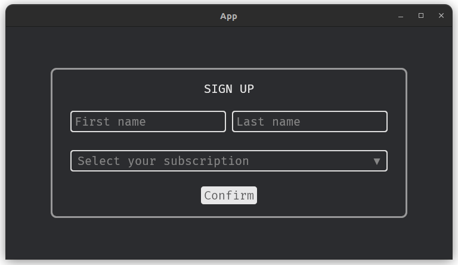

# Famiq

<p align="center">
  Simplifying UI Development in Bevy engine
</p>
<p align="center">
  
</p>

## What is Famiq?
**Famiq** is a UI library wrapped around Bevy UI module by providing default
widgets and a simple way to manage styles. Instead of writing Rust code for styling,
developers can define styles in a well known JSON file. These styles are then parsed
into Bevy's native UI styles, significantly reducing boilerplate code.

```rust
let txt = builder.fa_text("#signup-txt", "", "SIGN UP");

let f_name = builder.fa_text_input("#f_name", "", "First name");
let l_name = builder.fa_text_input("#l_name", "", "Last name");
let name_container = builder.fa_container("#name-container", "", &vec![f_name, l_name]);

let ask = builder.fa_selection(
    "#ask",
    "",
    "Select your subscription",
    &vec!["Personal".to_string(), "Team".to_string()],
);
let ask_container = builder.fa_container("#ask-container", "", &vec![ask]);

let btn = builder.fa_button("#btn", "", "Confirm");

builder.fa_container(
    "#container",
    "",
    &vec![txt, name_container, ask_container, btn],
);
```
<p align="center">
  
</p>


hot-reload can be enabled during development so that any changes made to the json file
are reflected immediately in the running app, no need to re-compile.

## Installation
Get latest version of `Famiq` by adding this line to `Cargo.toml`. Currently, crate & rustdoc are not available yet.
```toml
[dependencies]
famiq = { git = "https://github.com/muongkimhong/famiq", tag = "v0.2.2" }
```

## Documentation
- [See the docs](https://muongkimhong.github.io/famiq/)

## Contributing
Famiq needs your contributions to grow. Please see [contributing](https://github.com/MuongKimhong/famiq/blob/master/CONTRIBUTING.md).

## Versions
Famiq is new and still in early stage of development. Currently, it supports only 0.15.x onward.


## Goals
- API Improvements
- Provide more useful default widgets

## License
Famiq is released under the [MIT License](https://opensource.org/licenses/MIT).
