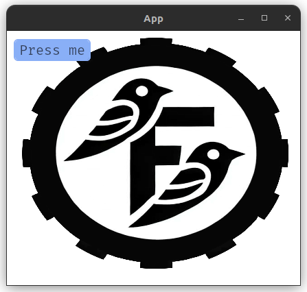

# FaBgImage

A widget use to create background image that covers the entire window in UI world.

```
🟢 Doesn't need container
🟡 Doesn't accept child/children
```

### API
```rust
pub fn fa_bg_image<'a>(builder: &'a mut FamiqWidgetBuilder, path: &str) -> FaBgImageBuilder<'a> {
    // ..
}
```
- `path`: Path to image relative to `assets` folder.
- Support only `jpg` and `png` format.

### Usage
```rust
fa_bg_image(&mut builder, "path/to/image.jpg").build();
```

### Example
```rust
fa_bg_image(&mut builder, "logo.jpeg").build();

let btn = fa_button(&mut builder, "Press me").class("is-primary").build();

fa_container(&mut builder).children([btn]).build();
```

