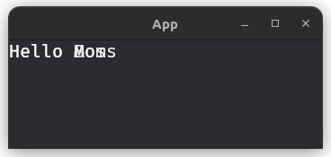

# FaContainer

```
🟢 Doesn't need container
🟢 Accepts child/children
```
An empty and stylyable widget. Think of it as a div inside HTML.

### API
```rust
pub fn fa_container(&mut self, id: &str, classes: &str, children: &Vec<Entity>) -> Entity {
    // ..
}
```

### usage via builder
```rust
let container = builder.fa_container(..);
```
Return `Entity` of the widget which can be used as child for another widget.

### Example
Texts without container
```rust
let boss = builder.fa_text("#boss", "", "Hello Boss");
let mom = builder.fa_text("#mom", "", "Hello Mom");
```


Texts inside container
```rust
let boss = builder.fa_text("#boss", "", "Hello Boss");
let mom = builder.fa_text("#mom", "", "Hello Mom");

builder.fa_container("#container", "", &vec![boss, mom]);
```


### Styling
Example of styling in json file
```json
{
  "#container": {
    "background_color": "srgba 0.929, 0.918, 0.075, 0.639",
    "border_color": "srgba 0.929, 0.918, 0.075, 0.639",
    "border_radius": "10px 10px 10px 10px"
  }
}
```

