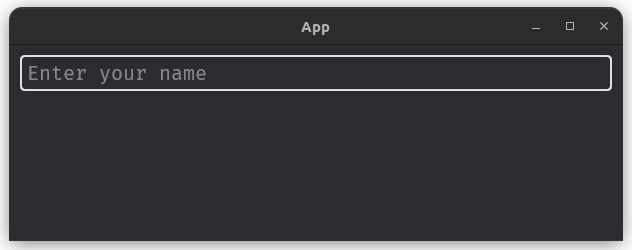

# FaTextInput

```
🟡 Needs container
🟡 Doesn't accept child/children
```

### Variants
```rust
pub enum TextInputVariant {
    Default,
    Outlined,
    Underlined,
}
```

### Colors
```rust
pub enum TextInputColor {
    Default,
    Primary,
    Secondary,
    Success,
    Danger,
    Warning,
    Info,
}
```

### Sizes
```rust
pub enum TextInputSize {
    Small,
    Normal,
    Large,
}
```

### Shapes
```rust
pub enum TextInputShape {
    Default,
    Round,
    Rectangle
}
```

### Resource
Resource to store key value pair of text-input id & its data.
```rust
pub struct FaTextInputResource {
    pub inputs: HashMap<String, String>,
}

impl FaTextInputResource {
    pub fn update_or_insert(&mut self, id: String, new_value: String) {
        // ..
    }
}
```

### API
```rust
pub fn fa_text_input(&mut self, id: &str, classes: &str, placeholder: &str) -> Entity {
    // ..
}
```

### Usage via builder
```rust
let input = builder.fa_text_input(..);
```
Return `Entity` of the widget which must be used as child of `FaContainer` widget.

### Built-in classes
- Color: `is-primary`, `is-secondary`, `is-warning`, `is-info`, `is-success`, `is-danger`.

- Size: `is-small`, `is-normal`, `is-large`.

- Shapes: `is-round`, `is-rectangle`.

- Variant: `is-underlined`, `is-outlined`.

### Example
```rust
let input = builder.fa_text_input(
    "#input",
    "",
    "Enter your name"
);
let input_warning = builder.fa_text_input(
    "#input-warning",
    "is-warning",
    "Enter your name"
);
let input_round = builder.fa_text_input(
    "#input-round",
    "is-round",
    "Enter your name"
);

builder.fa_container("#container", "", &vec![input, input_warning, input_round]);
```


### Getting input data
The input data can be read from `FaTextInputResource` within system.

```rust
fn my_system(input_resource: Res<FaTextInputResource>) {
    if let Some(data) = input_resource.inputs.get("#my-text-input-id") {
        println!("Data: {:?}", data);
    }
}
```
